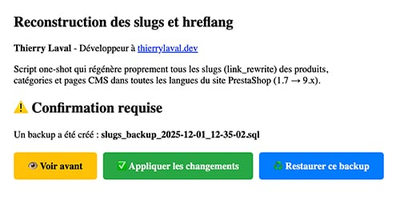

# Script : régénération des slugs PrestaShop

## Auteur

👤 **Thierry LAVAL** — [Contact](mailto:contact@thierrylaval.dev)

* Github : [@Thierry Laval](https://github.com/thierry-laval)
* LinkedIn : [Thierry Laval](https://www.linkedin.com/in/thierry-laval)
* Site Web : https://thierrylaval.dev

---

## 📎 Projet

Script one‑shot pour régénérer les slugs (link_rewrite) des produits, catégories et pages CMS pour toutes les langues d'un site PrestaShop (compatibilité 1.7 → 9.x).

_`Début du projet le 25/11/2025`_ — Version du script : 1.0.0 (25/11/2025)

### Sommaire

- [Script : régénération des slugs PrestaShop](#script--régénération-des-slugs-prestashop)
  - [Auteur](#auteur)
  - [📎 Projet](#-projet)
    - [Sommaire](#sommaire)
    - [Description](#description)
    - [🎯 Pourquoi ce script ?](#-pourquoi-ce-script-)
    - [🔁 Fonctionnement](#-fonctionnement)
    - [Prérequis](#prérequis)
    - [Fichiers générés](#fichiers-générés)
    - [Utilisation (via navigateur)](#utilisation-via-navigateur)
    - [Bonnes pratiques](#bonnes-pratiques)
    - [Sécurité](#sécurité)
    - [Restauration rapide](#restauration-rapide)
  - [Contribution](#contribution)
  - [Licence](#licence)
  - [Soutien](#soutien)
      - [♥ Love Markdown](#-love-markdown)
  
---

### Description

Petit script autonome qui recalcule et réécrit d’un coup tous les slugs (link_rewrite) des produits, catégories et pages CMS, sur l’ensemble des langues de ta boutique PrestaShop (compatible de la 1.7 jusqu’à la 9.x).

### 🎯 Pourquoi ce script ?

Des URL avec accents, majuscules, espaces ou caractères spéciaux nuisent au SEO et à la propreté du site. Corriger des milliers de slugs manuellement est ingérable.

Ce script fait tout en une seule passe :

* Normalise les slugs : minuscules, tirets, sans accents ni caractères indésirables  
* Gère toutes les langues et tous les shops automatiquement  
* Résout les doublons avec suffixe numérique (-1, -2…)  
* Mode simulation (dry-run) par défaut  
* Sauvegarde complète automatique  
* Export CSV détaillé des modifications  

Résultat : URLs propres, SEO-friendly, zéro risque.

### 🔁 Fonctionnement

Le script suit un processus clair, sécurisé et entièrement réversible :

* **Sauvegarde automatique**  
  Crée instantanément une copie datée des tables impactées (`ps_product_lang`, `ps_category_lang`, `ps_cms_lang` + shops en multistore).

* **Analyse & simulation (dry-run par défaut)**  
  Parcourt produits, catégories et pages CMS sur toutes les langues/shops, calcule les nouveaux slugs propres et détecte les doublons. Affiche un rapport détaillé (avant/après, nombre de modifications).

* **Résolution des conflits**  
  Ajoute automatiquement un suffixe numérique (-1, -2…) en cas de collision, dans l’ordre chronologique ou personnalisable.

* **Application réelle**  
  Avec l’option `--apply`, met à jour les `link_rewrite` et régénère le `.htaccess` si demandé (`--rewrite-htaccess`).

* **Export CSV**  
  Génère `slugs_modifications_YYYYMMDD_HHiiss.csv` : ID, type, langue, ancien → nouveau slug, statut.

Tout est relançable à volonté ; un simple restore des tables de backup suffit en cas de besoin.

### Prérequis

* PrestaShop installé (racine avec `config/config.inc.php` et `init.php`)  
* PHP exécutable avec accès à la base de données  
* Sauvegarde complète de la base fortement recommandée avant toute exécution

### Fichiers générés

* Backup SQL → `slugs_backup_YYYY-MM-DD_HH-i-s.sql`  
* Rapport CSV → `slugs_changes_YYYY-MM-DD_HH-i-s.csv`  
(tous deux placés dans le dossier du script)

### Utilisation (via navigateur)

1. Dépose le script à la racine de ta boutique  
2. Ouvre-le dans ton navigateur  

Actions disponibles (token quotidien affiché en haut de page) :

* **Simulation** → `?confirm=ton_token_du_jour&dry_run=1`  
* **Application réelle** → `?confirm=ton_token_du_jour`  
* **Restaurer un backup** → `?confirm=ton_token_du_jour&restore=nom_du_fichier.sql`  
* **Télécharger le CSV** → bouton ou lien direct après exécution  
* **Supprimer le script** → bouton sécurisé ou `?confirm=ton_token_du_jour&delete=1`

> Le token change chaque jour (ex : `tl_slug_20251201`)

### Bonnes pratiques

* Toujours commencer par la simulation + lecture du CSV  
* Vérifier l’existence du backup avant d’appliquer  
* Tester d’abord en staging quand c’est possible  
* Supprimer le script dès que le travail est terminé (bouton dédié)

### Sécurité

* Token quotidien requis pour toute action sensible  
* Backups automatiques systématiques  
* Accès fichier à restreindre (CHMOD 600 recommandé)  
* Suppression auto-proposée en un clic

### Restauration rapide

`?confirm=ton_token_du_jour&restore=slugs_backup_2025-12-01_14-30-22.sql`

---

## Contribution

Les contributions sont les bienvenues !

* Fork → nouvelle branche → commit → pull request.  
* Respectez les bonnes pratiques, tests et sécurité (ne pas committer les credentials).

---

## Licence

Ce projet est distribué sous licence MIT — voir le fichier LICENCE pour les détails.

Copyright © 2023–2025 Thierry Laval — https://thierrylaval.dev

---

## Soutien

Si ce projet vous aide, vous pouvez soutenir l’auteur :

[Voir mon travail](https://github.com/thierry-laval)

---

#### ♥ Love Markdown

Donnez une ⭐️ si ce projet vous plaît !

**FAN DE GITHUB !**

**[⬆ Retour en haut](#sommaire)**
